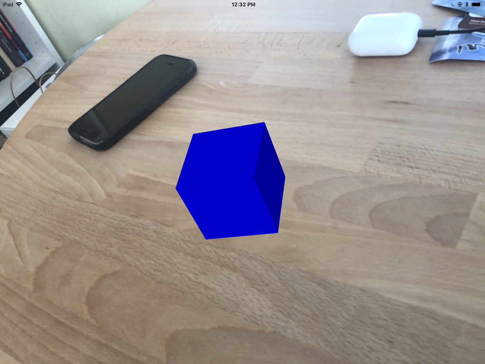

# ARKit Demo

First, choose SpriteKit (2D) or SceneKit (3D) by changing the line near the top of the view controller, then rebuilding. 

On an ARKit-supported device, start the app, then point the device's camera at a horizontal plane like a floor or tabletop. When you tap the object in the view, with SpriteKit, you should get a 2D sprite of a monster at that point in augmented reality. With SceneKit, you should get a 5cm blue cube placed on the plane. 

