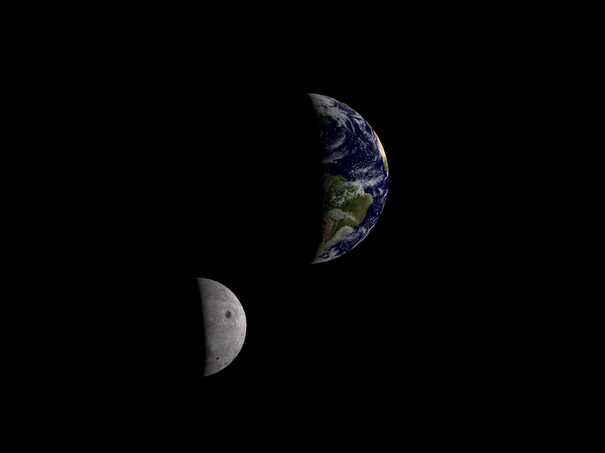

# SceneKit Standalone

The app displays two spheres, the Earth and the Moon. The Earth rotates on its axis and the moon revolves around it at 1/28th speed (one day versus one month). 

The relatively complex circular moon orbit path is accomplished using an invisible "moon rotator" node at the same point as the Earth. This node has the moon as its child. When rotated on its axis, it appears to make the Moon orbit the Earth. The same side always faces the Earth, but this is like real life since the Moon's completes one rotation in the same time it completes one orbit. 

Tap the screen to pause or resume the animation. At any point, you can use pinch gestures to zoom, a single-finger pan to rotate, and a two-finger pan to move the scene. 

