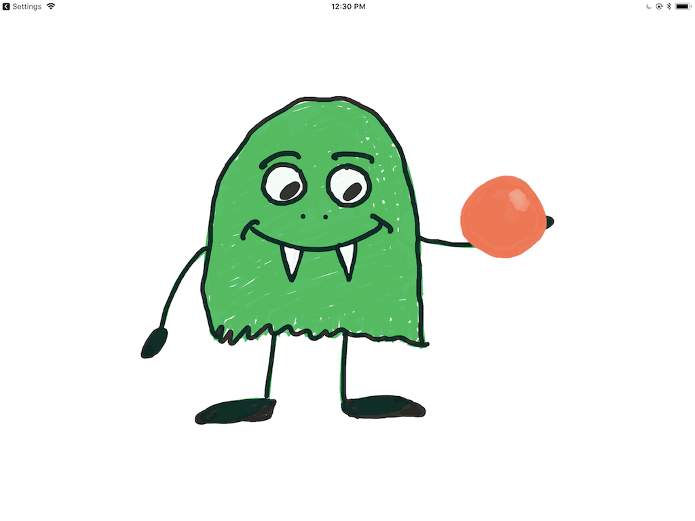

# SpriteKit Standalone

The app displays two sprites, a monster and a ball. When you tap the screen, the monster drops the ball, which bounces and rolls, then comes to a stop. 

Note the invisible floor node which interacts with the physics environment. 

